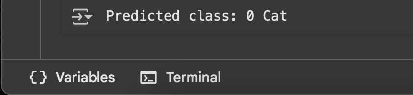

# Teachable Machine Image Classifier | AI for Robotics Task

This project demonstrates an AI-based image classification system built using Google's **Teachable Machine** and deployed with **TensorFlow Lite**. It simulates how a robot can use visual recognition to identify different objects or classes in its environment.

---

## 🌟 Objective

Train an image recognition model with at least two classes and deploy it to make predictions on unseen input images using Python.

---

## 🛠️ Tools & Technologies

- [Teachable Machine by Google](https://teachablemachine.withgoogle.com/)
- TensorFlow Lite
- Python
- Google Colab

---

## 🧪 Project Steps

### 1. Model Training

The model was trained using **Teachable Machine** with two image classes:

- Class 1: Example (e.g., "Apple")
- Class 2: Example (e.g., "Orange")

### 2. Model Export

The trained model was exported as:

- `TensorFlow Lite → Float32` format
- Includes:
  - `model_unquant.tflite` – the trained model
  - `labels.txt` – the class labels

### 3. Python Inference Script

A Python script was written to:

- Load the TFLite model
- Preprocess a given input image
- Run inference and print the predicted class

---

## 📂 Project Structure

```
🔍📂
├── model_unquant.tflite       # Trained TFLite model  
├── labels.txt                 # Class labels  
├── test.jpeg                   # Sample test image  
├── predict_image.ipynb          # Python prediction script  
├── screenshot.png             # Output from Colab (sample result)  
└── README.md                  # Project documentation  
```

---

## ▶️ How to Run

1. Install dependencies:

```bash
pip install tensorflow pillow numpy
```

2. Run the prediction script:

```bash
python tflite_predict.py
```

3. Expected output:

```
Predicted class: <ClassName>
```

---

## 📸 Sample Output



---

## ✅ Notes

- Model is optimized for 224x224 RGB images.
- Input image is normalized before inference.
- TensorFlow Lite is used to ensure compatibility and efficiency for embedded AI systems like robots.

---

## 📍 Use Case

This project aligns with AI for Robotics applications, where lightweight, efficient image classifiers are needed for robotic vision and decision-making.
